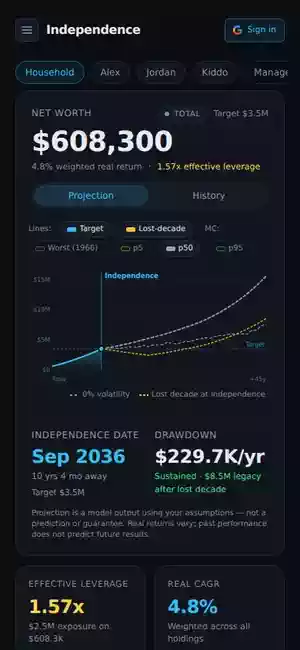

# wealthtrajectory

[](https://github.com/vsriram11/wealthtrajectory/actions/workflows/ci.yml)
[](https://codecov.io/gh/vsriram11/wealthtrajectory)
[](./LICENSE)
[](https://nodejs.org)

> **This project is source-available for personal and educational use. Commercial usage requires permission.**
> Licensed under [PolyForm Noncommercial 1.0.0](./LICENSE).

**Stress-test your financial-independence plan against a century of markets.**
**_Per-asset assumptions. In your browser. Never on a server._**

> ## Use the website → **[wealthtrajectory.vercel.app](https://wealthtrajectory.vercel.app)**
>
> Free. No signup. No install. No data ever leaves your browser. Open in any modern browser (Chrome, Safari, Firefox, Edge) on desktop or mobile and start planning.

> **Want Google Drive auto-sync?** The app works fully without sign-in — your data lives in your browser, and you can encrypt + export it to move between devices losslessly. For optional Google Drive auto-sync, email **varunsriram93@hotmail.com** with the Gmail address you want added. The project sits in Google's 100-user OAuth Testing tier (verifying would require a paid domain, which we deliberately avoid). Most users never need this — local export/import covers cross-device transfer. See [docs/OAUTH_VERIFICATION.md](./docs/OAUTH_VERIFICATION.md) for the full rationale.

## A quick visual tour

One continuous walkthrough — page overview, then four feature flows separated by title cards. Auto-loops; click to open the live website.

Track accounts and holdings across every asset class, project your trajectory to financial independence, and stress-test the plan against historical sequences of returns (1928–2025) — all in your browser. Your data never leaves your device unless you opt in to a Google-Drive backup of your encrypted state.

<p align="center">
  <a href="https://wealthtrajectory.vercel.app"></a>
</p>

> Capture pipeline + regenerate command documented in [`docs/Screenshots.md`](./docs/Screenshots.md). Specs at [`e2e/screenshots/`](./e2e/screenshots/).

## What you get

### Per-asset CAGR & composition-aware portfolio modeling

- **Per-holding expected CAGR.** Blended portfolio CAGR is *derived*, not assumed. Class-level seeds get you started (equity 7%, bond 1.5%, cash 0%); override per holding when you disagree.
- **Multi-asset wrappers decomposed.** NTSX → 90% S&P + 60% Treasuries (1.5× intrinsic leverage). AVGE → multi-region blend. Custom user-defined compositions supported.
- **Leverage-aware exposure.** TQQQ counts as 3× S&P exposure in every rollup, not face value.
- **Drift / concentration / fee-drag / asset-location audits.** 
- **Allocation time-travel.** Scrub 1–60 years ahead, *Apply above* — every rollup re-roots to the aged-forward household.

### Projections, stress tests, scenarios

- **Deterministic projection** — month-by-month forecast, custom glide path, account-weighted CAGR, Monte-Carlo stress overlay. Interactive NW chart with toggleable target / legacy / scenario overlays.
- **Historical Monte Carlo** — replays your portfolio against every 1928–2025 sequence. Returns success rate, percentile band (p1–p95), and the *specific* worst-case starting year ("Worst: 1929"). Block-bootstrap mode for wider distributions. Honors glide paths + mid-year cash-flow timing.
- **Scenario engine.** Save plans side-by-side; each overrides per-account contributions and per-holding CAGRs. Comparison chart shows time-to-target deltas.
- **What-if + sensitivity strips.** "$X/mo extra saving" slider. ±2pt CAGR and 0.5×–2× savings-rate sensitivity in a glance.
- **Coast / barista / lean / fat independence math** via a finite-horizon Gordon-growth variant — no perpetuity singularity when category real CAGR approaches SWR.

### Tax-aware drawdown sequencing

- **Multi-phase retirement** — stage drawdowns by life phase (pre-SS high-draw bridge → post-SS steady → late-life conservative) instead of one flat rate. Edit a phase, projection recomputes downstream.
- **Bucket-order sequencer** (taxable → pre-tax → Roth → HSA) with RMD math and tax gross-up — the projection knows your *after-tax* spend.
- **Roth conversion ladder**
- **Asset-location audit**

### Budget that drives the projection

- **Budget tracker** — categorized, fixed-vs-variable, per-member. *Ends-at-retirement* tags (mortgage, college) so retirement-spend reflects the *future* load, not today's.
- **One-tap *Apply to Independence target*** writes the budget-implied corpus into the plan — no more "wait, what target did I pick?"
- **Subscription manager** — tag any line as a subscription with a billing cycle. Monthly cost, next billing date, annualized total. Local-first version of what Rocket Money charges monthly for.
- **Emergency-fund check** — derives months-of-expenses runway from the budget.
- **Dynamic-spending haircut** — variable retirement spend can be cut conditionally (only after down-market years). The realistic guardrail strategy: higher expected lifestyle than always-apply, better survival than no haircut.

### Multi-member household with rollup control

- **Per-member ages, incomes, contributions, drawdown phases, assumption overrides.** Every projection composes cleanly with the member filter.
- **Rollup-include toggle** — temporarily set someone aside from household totals (kid, scenario-modeling a non-earning partner) without losing their data. NW, projection, Monte Carlo, insights, budget all cascade in lockstep.
- **Future-income streams** — multiple periods of part-time income, Social Security (seeded for demo earners via a 2025-SSA-bend-point estimator), pensions, rental income. Each has start/end year, real-dollar amount, optional real-growth rate. Flows into MC + projection as positive cash flow.
- **Goals tracker, health-insurance modeling, NW percentile** vs the Fed-SCF cohort for your age × income bracket.

### Insight & guidance

- **Smart insights** — annual NW change, cash drag, high-APR liability alerts, per-account goal sensitivity analysis.
- **Trailing reality checks** — doubling time, growth velocity (real vs. nominal), contribution-vs-market split of current NW.
- **Future-dollar equivalent** — translates your real-dollar plan into sticker-price terms ("$2M real ≈ $4M nominal at 3% inflation").
- **Health score** — 0–100 composite (progress, diversification, liquidity, leverage safety).
- **Reminders** — optional.

## Why local-first

The deterministic engines and the Monte Carlo simulator are pure
TypeScript with no React or store imports — `lib/projection/independence.ts`,
`lib/projection/monteCarlo.ts`, `lib/portfolio/futureAllocation.ts`, etc. You can lift them
into a CLI, a worker, a different UI shell, or a notebook, and they'll
produce the same numbers. The math invariants are pinned by tests
alongside each engine: Trinity SWR cross-reference, CPI deflation, mid-
year compounding convention, glide-path interpolation, real-vs-nominal
identity, leverage compounding, sequence-of-returns regressions, etc.

This split is intentional: the engines belong to you and your
spreadsheets; the React shell is just a fast way to interact with them.

## Privacy model

- 100% client-side computation. No analytics, no telemetry, no third-
  party trackers in the bundle.
- Persistence is **IndexedDB** by default. State stays on the device.
- **Local export/import** (encrypted with a user-set passphrase, or
  plaintext) works without any sign-in. The same AES-256-GCM envelope
  format ships your data to a file you can move across devices via
  AirDrop / iCloud / Dropbox / email — Google holds nothing.
- **Optional Google Drive backup** uses the per-app `appDataFolder`
  sandbox and supports end-to-end encryption with a user-set passphrase
  — Google holds the ciphertext, you hold the key.
- The historical-returns dataset (Damodaran, Jan 2026 refresh) ships in
  the bundle so there's no network call to render any chart.

> **Drive sync is in Google's 100-user OAuth Testing tier.**
> The project deliberately doesn't pursue verification (would require an
> owned domain → recurring $$). Sign-in requires the Gmail to be on the
> OAuth test-user allowlist — email **varunsriram93@hotmail.com** with the
> address you want added (usually within 24h). Past the 100-user cap, or
> for anyone who'd rather skip sign-in entirely, the Data page's local
> export/import remains the free, encrypted, cross-device path. See
> [docs/OAUTH_VERIFICATION.md](./docs/OAUTH_VERIFICATION.md) for the full
> rationale + the recipe for verifying if we ever change our mind.

See [docs/PrivacyAndSecurity.md](./docs/PrivacyAndSecurity.md) for the
threat model and encryption design.

## Running locally

The hosted website on Vercel's free tier covers anyone who just wants to use the planner — see [Use the website](#use-the-website-) at the top. If you'd rather run the code on your own machine (offline-capable, full source control, no hosted dependency at all):

```bash
npm install
npm run dev            # http://localhost:3000
npm test               # full suite: engine + slice + component + property-based
npm run test:watch     # interactive — re-runs on file save
npm run test:coverage  # vitest with v8 coverage report
npm run verify         # typecheck + lint + test + build (what CI runs)
npm run build          # production build, suitable for static hosting
```

Tested on Node ≥ 20, modern Chromium / Firefox / Safari.

## Testing posture

This codebase is test-driven on the math. The suite (1100+ tests
across the engine, slice, component, and property-based layers)
pins every engine's input → output contract; the property layer
(20+ invariants via fast-check) guards laws that example-based
tests miss (real ↔ nominal involution, glide-path interpolation
bounds, Monte Carlo percentile ordering, rollup-filter
composition, haircut monotonicity, income-stream additivity).
Engine coverage sits at ≥ 90% line /
branch.

The discipline is documented end-to-end in
[`docs/Testing.md`](./docs/Testing.md): the TDD loop, what each
suite guards, when to reach for property-based tests, and the
quality bar a test must clear to land. CI runs typecheck +
lint + test + build on every PR (`~90s`); Husky pre-commit runs
`eslint --fix` on staged files.

## Architecture, in one paragraph

Next.js App Router (`app/`) for routing + the React shell. State lives
in a Zustand store (`lib/store.ts`) with a hydrate-from-IndexedDB
pattern; the store is the only persistence boundary. Every engine is a
pure function under `lib/` and accepts a `Household` + `Assumptions`
input — no hidden globals. Charts are hand-rolled SVG (no Recharts) so
the bundle stays small. Glide paths, real-vs-nominal conversion, and
mid-year cash-flow timing are documented at
[docs/Calculations.md](./docs/Calculations.md).

## Project status

The build is feature-complete for personal financial-independence
planning. Distribution is intentionally low-pressure: launched on
GitHub + Vercel free tier with the project speaking for itself.
There's no startup, no upsell, no premium tier — every feature in
the codebase works for every user. The `ProGate` wrapper component
is preserved as a pass-through so the gating call sites in the
codebase remain in one place — useful self-documentation about
which surfaces were conceived as advanced features, with no
behavioral effect in this build.

## Built with Claude Code

This repo ships first-class support for [Claude Code](https://claude.com/claude-code):

- [`CLAUDE.md`](./CLAUDE.md) — load-bearing patterns + how to use sub-agents productively on this codebase
- [`.claude/agents/`](./.claude/agents/) — custom subagent definitions (`team-lead`, `code-reviewer`, `feature-builder`) for multi-phase work
- [`.claude/skills/`](./.claude/skills/) — task-pattern skills (`adding-an-asset-class`, `adding-a-rollup-aware-collection`, `investigating-a-ci-failure`, `agent-team-orchestration`, `capturing-readme-walkthroughs`)
- [`.claude/settings.json`](./.claude/settings.json) — curated permission allowlist + status line

The full story — workflow patterns, agent-team orchestration, self-healing CI loop, hallucination defense, the spec-first / TDD discipline this codebase was built under — is in [`docs/AI_DEVELOPMENT.md`](./docs/AI_DEVELOPMENT.md).

## License

[PolyForm Noncommercial 1.0.0](./LICENSE). You can use, modify, and
share this code freely for personal, educational, research, and other
noncommercial purposes. **Commercial use requires written permission
from the maintainer.** Commercial use includes (per the license) any
use with anticipated commercial application — running this as a paid
SaaS, bundling it into a paid product, or deploying it as part of a
revenue-generating service.

## Contributing

PRs welcome for bug fixes, math corrections, accessibility
improvements, and documentation. See
[CONTRIBUTING.md](./CONTRIBUTING.md) for the slice / registry
patterns, commit conventions, and pre-commit setup. The
architecture is laid out in
[docs/ARCHITECTURE.md](./docs/ARCHITECTURE.md). Open an issue
first for larger feature ideas so we can align on scope.

Engine-touching changes require a test that pins the input →
output contract — the `*.test.ts` files in `lib/` are this
project's contract with users.
